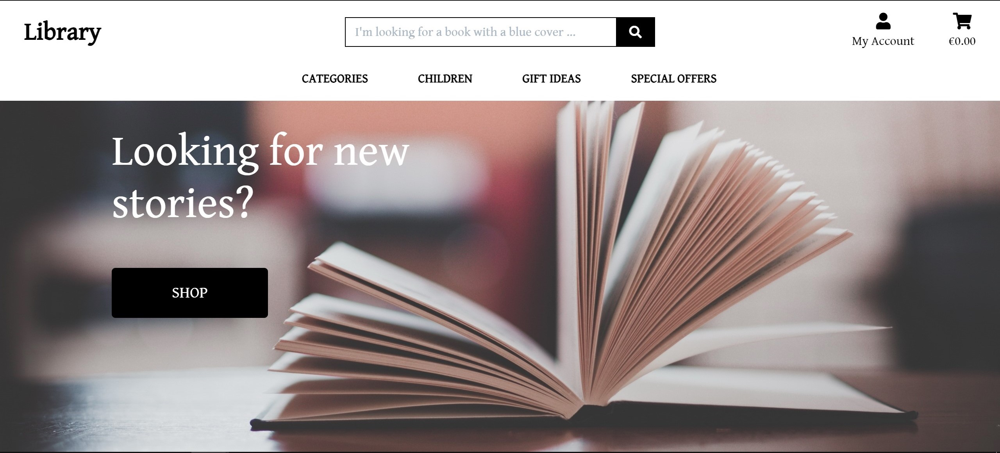
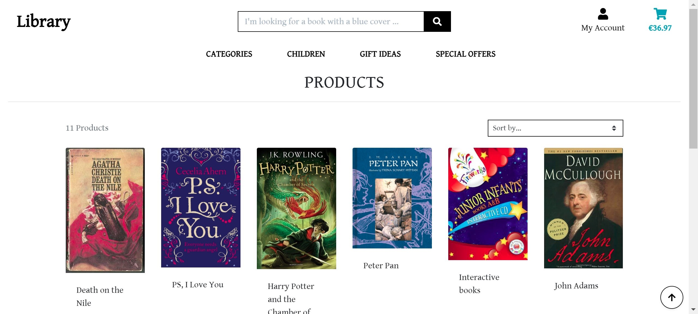
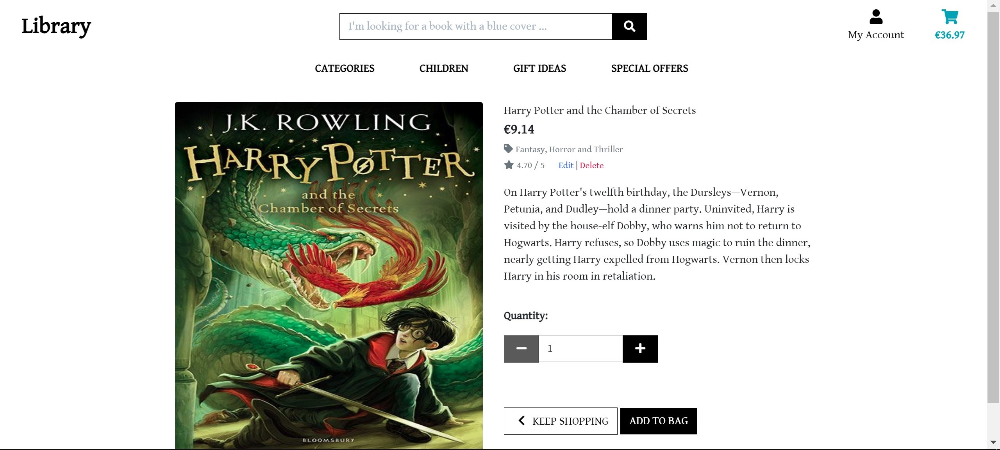
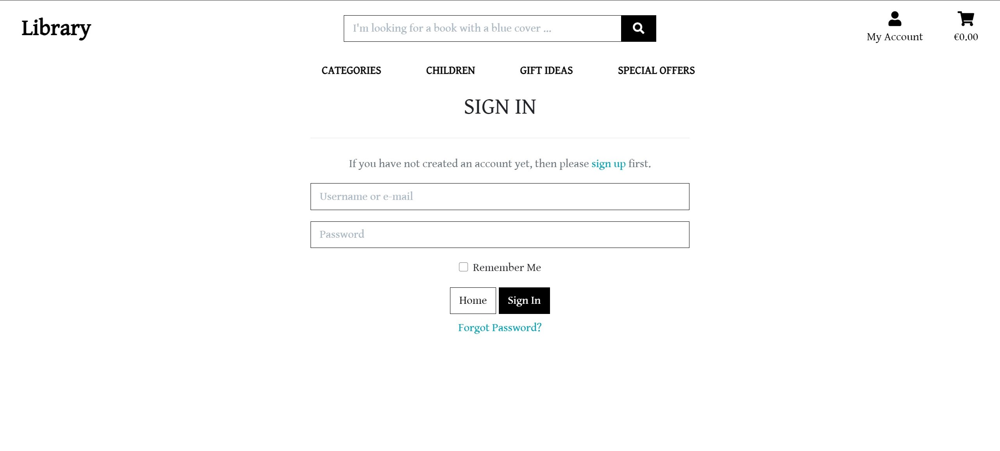
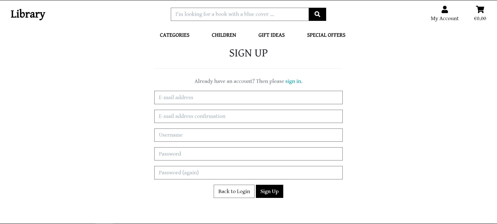
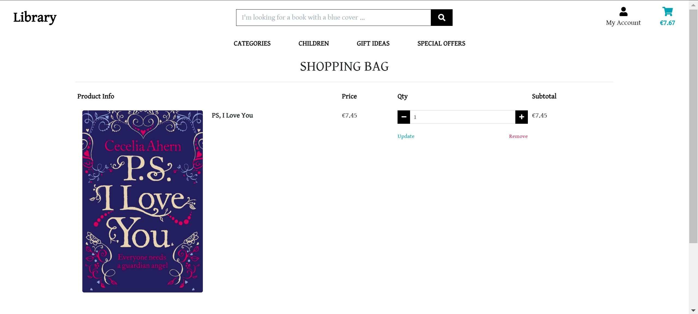
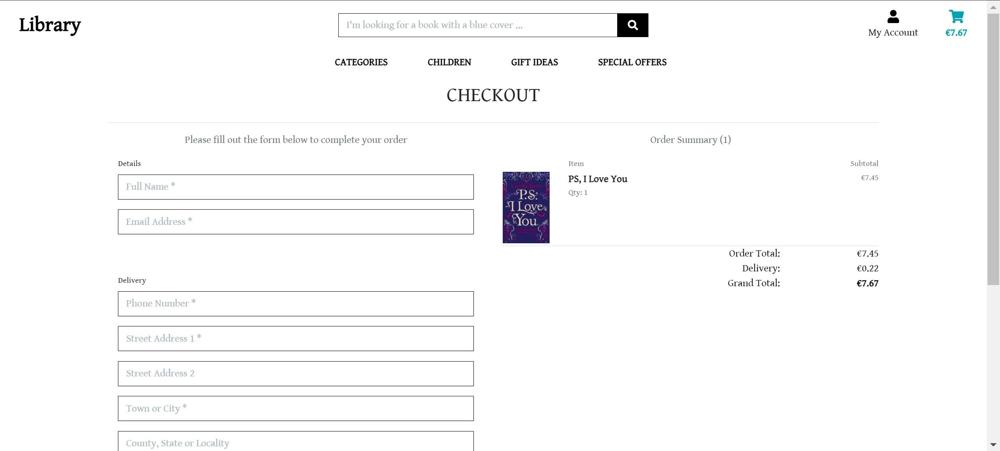
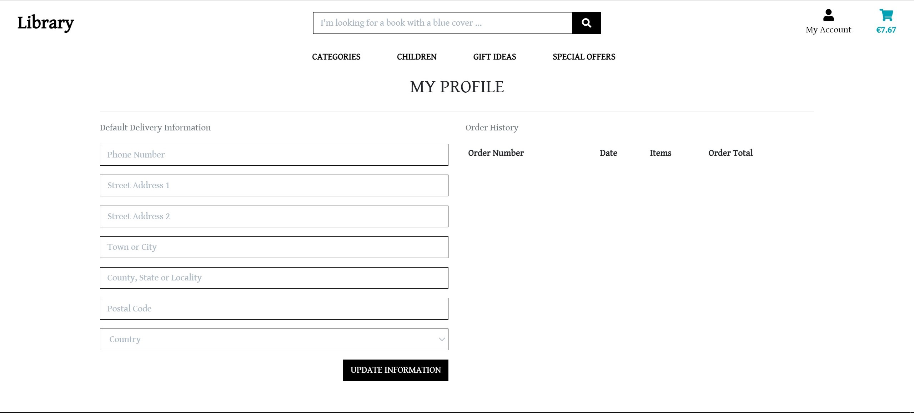
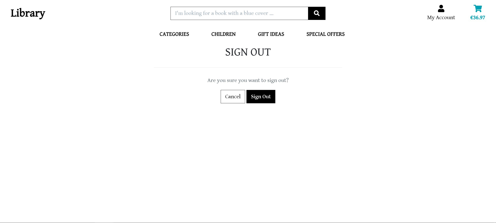

# Library

My Website has been developed for Code Institute's Full-Stack Frameworks with Django Milestone Project and represents an e-commerce. It is a minimalist and essential site for books sale suitable for small bookshops who want to have an online window!

 Visit the Website: 
 

[Library](https://salvo-library.herokuapp.com/)

## UX

### Project Purpose

The goal of Library is to give the user a good experience when purchasing book(s) in a simple & effective way using the following functions:

- User registration form
- User log in control
- Log out
- Recover forgotten password
- Viewing profile Information page
- Viewing purchase history
- Edit delivery address
- Easy navigation
- Search quickly using the search bar
- Viewing name, cover, description, price, rating of book(s)
- Sort/order the catalog of book(s) by:
    - price low to high/high to low;
    - rating low to high/high to low;
    - name low to high/high to low;
    - categories low to high/high to low; 
- View the existing categories
- Adding book(s) to the cart
- Adjusting the quantity of book(s) in cart
- Removing book(s) from cart
- Secure online payment

From the perspective of the website seller or operator, Library's goal is to offer a good experience when updating the website in a simple and effective way by using user functions in addition to the following:

- Log as Admin/Superuser
- Add, modify or delete item(s)/book(s):
    - Category;
    - Name;
    - Description;
    - Price;
    - Rating;
    - Image by url or loading;
- Add, modify or delete categories
- Add, modify or delete an order
- Authenticate user log in, emails

### User Experience

- Users are presented with a simple user interface that uses buttons and drop-down menus for easy navigation at the top of
the screen for viewing mobile and tablet devices and a navigation list on the side of the desktop display for a home / Library, a log, services, products, shopping cart, access and review depending on the user's login status.

- At the top of the page there is always the navigation bar to prevent a user of a device from being forced to go back or scroll to the menu to navigate.

- All the books on the product page have a title, price, category, rating. As Admin / Superuser there are also two buttons to edit and delete.

- Clicking on the cover of the books the user will be redirect to the book details. The presentation page divided into two quadrants, on the left the cover image, on the right the name, the price, the category it belongs to, rating, a short description, a button to change the quantities, a button to return to the previous page , a button to add to cart. Also, on this details page, as Admin / Superuser there are also two buttons to edit and delete.

- When the user adds, modifies, removes or performs a login, log out, purchase action, a notification is displayed with a toast. The displayed message is fixed under the cart and the colors are changing according to the type of message displayed.

- The layout remains the same to try to keep things simple and hassle-free when navigating from page to page, which prevents the user from clicking the browser's back button.

- The login or registration forms will not be displayed to the incoming user to maintain navigation even for users who wish to purchase without registering or logging in.

- The layout of a white background has been included on the product and service pages to keep the layout clean and speed up loading times if there are many products or services to display on a device. The only background image is shown on the home screen as a stylistic and aesthetic presentation to the website.

- Login and registration have been implemented on the website to help protect user data such as confidential information and Stripe takes care of card payments.

### User Stories:

- As an entrepreneur, I want to have a way to easily manage my e-commerce. I want to be able to have a site where I can sell to an online customers with speed and simplicity.

- As a website owner and sole trader, I want my website to be efficient, intuitive and suitable for everyone. I need an easy way to increase my sales and find a growing audience of buyers.

- As a professional seller, I need to increase my profits and be competitive. 

- As a Library customer I can manage my account, buy book(s) and be kept up to date with upcoming news or finding something to read as a hobby.

- As a Library customer I can easily browse and navigate the website and find the best offers, gift ideas, or what I am passionate about.

- As a website user, I can count on fast delivery, updated catalog and I don't have to worry about my password or card details being stolen because the site has a secure payment method.

### Design ideas

The design of the Website is very clear and minimal, it has a simple straightforward layout without over-complication. 

- #### Characters

    - The font used is Gentium Book Basic and I choose it to keep things simple.

- #### Colors

    <b> black / white </b>
    These colors were used for most of the pages on the website, including the text, navigation, and button elements.
     

   
    <b> white </b>
    This color was used for the background, except on the home page.
     
    
- #### Styling
    
    ** Special styles include: **
    
    - ** Buttons - ** The buttons were designed using bootstrap and the colors were chosen using the bootstrap color scheme. I used Font Awesome to add icons to buttons to help users better understand the purpose of this essential proposal.
        
    
    - ** Pagination - ** Pagination consists of a navigation menu at the top.

### Wireframe

The wireframes have not been created from zero but copied by an already existing project and modified where needed.

- #### Wireframe

    - Home
    

    - Products Page
    

    - Details Books Page
    

    - Login page
    

    - Registration page
    

    - Cart Page
    

    - Payment form
    

    - Profile page
    

    - Log out Page
    

### Developer and commercial purpose

- Must show clear and professional examples of HTML5, CSS3, JavaScript and Python.

- Must show the use of Django's knowledge.

## Features

### Existing features

#### Navbar:

- The navigation bar is fixed and present at the top of the page for easy navigation even when the user is at the bottom.

** Desktop **
- At the top left there is the logo of the brand, linked to the home page.

- In the center, at the top, there is a search bar.

- Below the search bar there are the buttons with the categories in a drop down menu. For a targeted and cleaned search by the user.

- At the top right there are two buttons, one for the profile, one for the cart.

** Tablets and mobile devices **

- The menu is displayed with the layout of the hamburger where the home and categories are located. The search bar, profile and the shopping cart remain visible through icons.

- The page content is resized accordingly to the size of the smallest devices screen size.

#### Home page:

- Provides the user with a friendly and simple complete view of the website layout. The screen is dominated by an image and a question that invites the user to explore the site.

#### Product page:

- It show to users available books with name, price, membership category, rating.

- As Superuser / Admin there are also the edit and delete buttons.

#### Login page:

- ** Login Form ** - A login form has been added so that the user can access the website. If a user enters invalid credentials, access will be denied. Furthermore, both fields are required for successful login.

#### Registration page:

- ** Registration Form ** - A registration form has been added so that the user can register on the website. There are five required fields, email address, email confirmation, username, password and password confirmation. All fields must be filled in before they can register successfully, otherwise they will receive a notification from the form to fill in the missing or incorrect details. The Password and Confirm Password fields must also match before a user can successfully register. Same for the email fields. Upon successful registration, an email is sent to confirm the email that redirects you to the website to log in and confirm access. There is also a link, in the registration page, that can be used to log in if you have already an account. 

#### Cart page:

- ** Cart ** - When a user has placed something in the cart, the items in the cart will be displayed and the user can proceed to checkout or open their items if they want to change the quantity.

#### Payment page:

- ** Payment module ** - Stripe was used to complete the purchase in a safe and secure way for the user.

#### Successful Payment Page:

- ** Successful payment box ** 
  - A page is displayed confirming the successfull purchase and an email, with a summary of your purchases, is sent to your email address.

#### Profile page:

- ** User Profile ** 
  - When a user is logged in, they can view their profile on the profile page. It will give them the possibility to change the delivery address and view a summary of their previous purchases.

### Features Left to Implement

- Modify the search bar, so that it can be integrated stylistically to the website.
- Integrate the confirmation message to the request of delete an item from cart.
- Integrate the option to delete your profile from the website.

## Technologies Used

### Tools
- [Gitpod] (https://gitpod.io) IDE used.
- [Django] (https://www.djangoproject.com/) The python framework used as required by the project requirements.
- [Stripe] (https://stripe.com) was the intended tool for using secure payments.
- [PIP] (https://pip.pypa.io/en/stable/installing/) used to install requirements in the project.
- [Gunicorn] (https://pypi.org/project/gunicorn/) Used for the distribution of a Django project in Heroku.
- [Django Heroku] (https://pypi.org/project/django-heroku/) is used to view the distributed project.
- [GitHub] (https://github.com/) is used as a remote backup of the code used in the project and used to show the code remotely.
- [Django Allauth] (https://django-allauth.readthedocs.io/en/latest/installation.html) used for login and registration.
- [Django Crispy-forms] (https://django-crispy-forms.readthedocs.io/en/latest/) used to create CSS embedded template packages.
- [Django Pillow] (https://pillow.readthedocs.io/en/stable/) used to allow uploading of images via my admin page.
- [Webhook_handler] (https://developers.google.com/assistant/conversational/webhooks) used as event handlers of the Event Grid.

### Libraries
- [Bootstrap] (https://www.bootstrapcdn.com/) to assist with the layout and style of the website.
- [FontAwesome] (https://www.bootstrapcdn.com/fontawesome/) to apply the information icons used throughout the website.
- [Google Font] (https://fonts.google.com/) used to change the base font. Used the font (Gentium Book Basic).
- [Jquery] (http://code.jquery.com/) used for the front-end of websites.
- [Css-tricks] (https://css-tricks.com/) used to edit toast messages.

### SQL Database:
- [dj-database-url](https://pypi.org/project/dj-database-url/) - package allows connection to a database URL (eg Heroku Postgres).
- [Heroku Postgres](https://www.heroku.com/postgres) - cloud-based Postgres managed SQL database to use in deployment instead of sqlite3 for production.
- [SQLite3 DB](https://docs.python.org/2/library/sqlite3.html) - the standard database on django using Django's ORM in development for local testing.
- [AWS S3 Bucket] (https://aws.amazon.com/) to store all information, not contained on Heroku, on the database of products and services.

### Languages
- The languages ​​used throughout the website are HTML5, CSS3, JavaScript and Python.

## Index and reference code
- I modeled my django code from the mini-project of my course and then I modified it as I prefered and I tailored my code to reach my goal and create my personal project. I used the Bootstrap framework to build the site and fontawesome for the icons. I have customized the e-commerce so that it was unique.

## Testing

Testing was done using Chrome's developer tools to try and figure out how to make layout changes, to find out what code would be needed to get the layout or changes I was looking for. I also tested different images, layouts and colors based on my knowledge and experience until the entire project looked like what I wanted to reach and made me happy about.

- [Travis CI] (http://travis-ci.org) which tests the code every time it is submitted to GitHub.
- [HTML validator] (https://validator.w3.org/)
- [CSS validator] (https://jigsaw.w3.org/css-validator/)
- [Jasmine] (https://jasmine.github.io/pages/getting_started.html)
- Tested the entire site on [Responsinator] (http://www.responsinator.com) as a backup to ensure responsiveness.
- [PEP8] (http://pep8online.com/) for Python validation.
- [Test Card] (https://stripe.com/docs/testing#cards) has verified that all fields require completion.
- [Jshint] (https://jshint.com/) for JavaScript validation.
- [Dev Google] (https://developers.google.com/web/tools/lighthouse#devtools) revised the entire site. 

## Deployment

- I have distributed my code on gitpod in my GitHub repository. From my github repository it was connected to the Heroku server, the website was connected to the AWS S3 cloud database and wired with Stripe for secure payments. During the distribution, I made sure not to send any secret keys or data that could be exploited by cybercriminals.
- I made sure that debugging was turned off to avoid unwanted leaks of sensitive code. All code worked and then submitted for evaluation via appropriate links and stored on GitHub.
- I've made code changes and fixed known bugs and issues I've struggled with such as stripe payments which now work.
- I also changed the debug to false before distribution.

## Credits

### Content

I tried to reproduce an e-commerce by taking inspiration from the sites of big companies on the market.

### Media
- I took pictures, names, reviews from Amazon. (https://www.oprahmag.com/entertainment/books/a29576863/types-of-book-genres/)(https://www.waterstones.com/books/search/term/the+help)
- Google Image Search for images used in this project with reuse rights.

### Acknowledgements
- Code Institute for providing the knowledge and challenge in creating this project. [Code Institute](https://codeinstitute.net/)